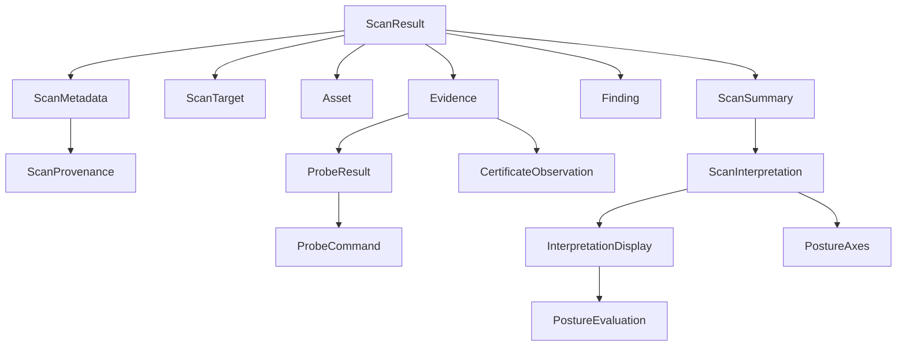
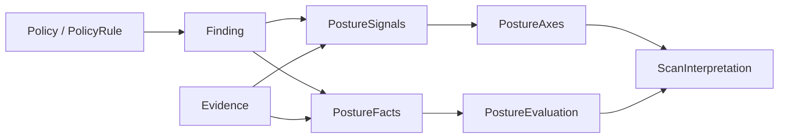
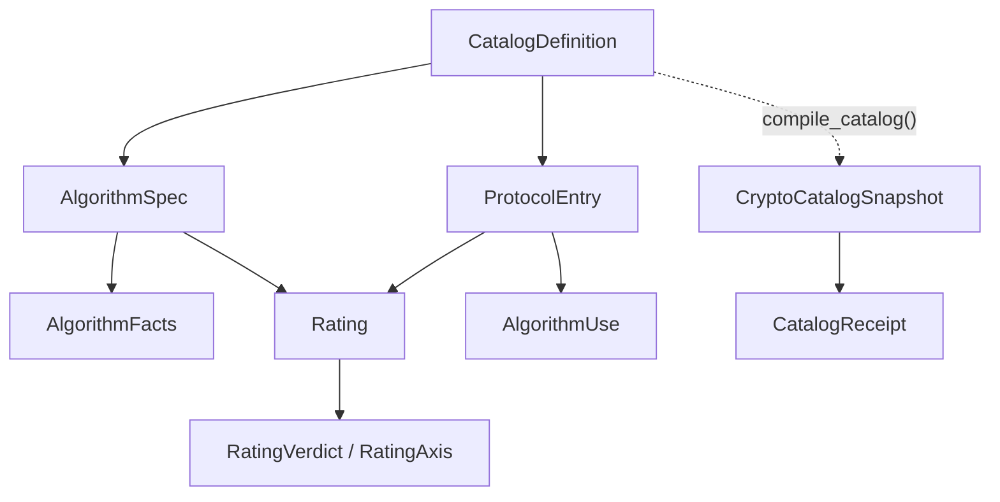

<!-- SPDX-License-Identifier: Apache-2.0 -->
<!-- The enum table and annotated-field graph below are generated by
     scripts/gen_data_model.py. Edit the surrounding explanation, not the generated sections. -->

# Data model and relationships

QuReddy turns one scan into one verdict. This page explains that path and inventories every
class and enum under `src/qureddy`. A checked generator owns the enum table and class graph.

## Contents

1. [The story in one breath](#1-the-story-in-one-breath)
2. [The result tree](#2-the-result-tree)
3. [How a verdict is built](#3-how-a-verdict-is-built)
4. [The crypto catalog (new, not wired yet)](#4-the-crypto-catalog-new-not-wired-yet)
5. [The two-vocabulary seam](#5-the-two-vocabulary-seam)
6. [Every enum](#6-every-enum)
7. [Every class and annotated-field relationship](#7-every-class-and-annotated-field-relationship)
8. [Regenerate this page](#8-regenerate-this-page)

## 1. The story in one breath

1. You give QuReddy a target.
2. `CollectorRegistry` selects a collector that can run the TLS, SSH, or IKE scanner.
3. The scanner probes and records `Evidence` (the audit trail) and `Finding` (decisions over evidence).
4. Findings and evidence become `PostureSignals`, `PostureFacts`, and five independent posture axes.
5. The axes and evaluation become a `ScanInterpretation` (readiness, HNDL exposure, and hygiene).
6. Everything hangs off one immutable `ScanResult`, which renders as rich, JSON, JSONL, or CBOM.

One rule holds the design together: **evidence is the trail, findings are decisions over
evidence, the summary is the rollup.** A renderer never infers a finding, and raw probe output
never lands in a renderer.

## 2. The result tree

`ScanResult` is the root. Everything the CLI emits hangs off it.



- `Evidence` is the audit trail: what was observed, how, with what confidence.
- `Finding` is a decision over evidence: a rule matched, with severity and readiness.
- `ScanInterpretation` is the verdict layer. It is the only place the axes and readiness live,
  which is why any score or grade attaches here, not to raw findings.

## 3. How a verdict is built

The verdict is not read off one field. It is derived from five independent axes plus semantic
signals, so no single finding can mask another.



The five axes are: `pqc_support`, `key_exchange`, `downgrade_resistance`, `authentication`,
`protocol_hygiene`. Keeping them independent is what prevents the harvest-now/decrypt-later
verdict from being overwritten by a single classical-hygiene finding.

## 4. The crypto catalog (new, not wired yet)

`core/crypto_catalog/` is a typed, immutable, digest-receipted catalog of algorithms. It is
built by `compile_catalog(definition)` into a `CryptoCatalogSnapshot`.



Today it ships with no production data and is imported by nothing outside its own package. It
is the intended future single source for classification, not a live part of a scan yet.

## 5. The two-vocabulary seam

This is the one relationship that is missing on purpose, and it matters.

- The live scan path speaks `Readiness` and `AxisStatus`.
- The catalog speaks `RatingVerdict` and `RatingAxis`.
- No edge connects them.

The vocabularies overlap but have different scopes: catalog ratings describe algorithms and
protocol entries, while the live vocabulary describes observations and endpoint posture. Until
one compatibility bridge derives the live view from populated catalog ratings, both remain
editable truth sources and can disagree. Issues
[#746](https://github.com/BreachSAFE/qureddy/issues/746) and
[#747](https://github.com/BreachSAFE/qureddy/issues/747) track the related certificate,
algorithm-fact, vocabulary, and classifier consolidation.

## 6. Every enum

The generated table shows both Python member names and serialized values.

<!-- BEGIN GENERATED: enum-table -->
| Enum | Module | Members and serialized values |
|---|---|---|
| `AxisStatus` | `core.vocabulary` | `HYBRID = "hybrid"`, `PURE_PQ = "pure_pq"`, `CLASSICAL = "classical"`, `ACCEPTABLE = "acceptable"`, `ACTION_NEEDED = "action_needed"`, `UNKNOWN = "unknown"`, `NOT_TESTABLE = "not_testable"`, `NOT_APPLICABLE = "not_applicable"` |
| `Capability` | `core.contracts` | `TLS_ENDPOINT = "tls.endpoint"`, `SSH_ENDPOINT = "ssh.endpoint"`, `SSH_PUBLIC_KEY = "ssh.public_key"`, `SSH_CONFIG = "ssh.config"`, `X509_CERTIFICATE = "x509.certificate"`, `IKE_ENDPOINT = "ike.endpoint"` |
| `CollectionFailureKind` | `core.contracts` | `TIMEOUT = "timeout"`, `UNAVAILABLE = "unavailable"`, `MALFORMED = "malformed"`, `PERMISSION_DENIED = "permission_denied"`, `UNSUPPORTED = "unsupported"`, `EXECUTION = "execution"` |
| `ComponentRole` | `core.crypto_catalog.models` | `KEY_ESTABLISHMENT = "key_establishment"`, `CONFIDENTIALITY = "confidentiality"`, `AUTHENTICATION = "authentication"`, `INTEGRITY = "integrity"`, `PRF = "prf"`, `TRADITIONAL_COMPONENT = "traditional_component"`, `POST_QUANTUM_COMPONENT = "post_quantum_component"` |
| `Confidence` | `core.vocabulary` | `HIGH = "high"`, `MEDIUM = "medium"`, `LOW = "low"` |
| `CryptoPrimitive` | `core.crypto_catalog.models` | `AE = "ae"`, `BLOCK_CIPHER = "block-cipher"`, `COMBINER = "combiner"`, `DRBG = "drbg"`, `HASH = "hash"`, `KDF = "kdf"`, `KEM = "kem"`, `KEY_AGREE = "key-agree"`, `KEY_WRAP = "key-wrap"`, `MAC = "mac"`, `PKE = "pke"`, `SIGNATURE = "signature"`, `STREAM_CIPHER = "stream-cipher"`, `XOF = "xof"`, `OTHER = "other"`, `UNKNOWN = "unknown"` |
| `DigestScope` | `core.crypto_catalog.models` | `CANONICAL_DEFINITION = "canonical_definition"`, `PUBLISHED_BYTES = "published_bytes"` |
| `EntryKind` | `core.crypto_catalog.models` | `CIPHER_SUITE = "cipher_suite"`, `KEY_EXCHANGE = "key_exchange"`, `HOST_KEY = "host_key"`, `CIPHER = "cipher"`, `MAC = "mac"`, `PUBLIC_KEY = "public_key"`, `PRF = "prf"`, `INTEGRITY = "integrity"` |
| `FailureCategory` | `core.vocabulary` | `LOCAL_OPENSSL_MISSING = "local_openssl_missing"`, `LOCAL_OPENSSL_BROKEN = "local_openssl_broken"`, `LOCAL_OPENSSL_VERSION_UNREADABLE = "local_openssl_version_unreadable"`, `LOCAL_OPENSSL_IS_LIBRESSL = "local_openssl_is_libressl"`, `LOCAL_OPENSSL_TOO_OLD = "local_openssl_too_old"`, `LOCAL_OPENSSL_VERSION_MISMATCH = "local_openssl_version_mismatch"`, `LOCAL_OPENSSL_LACKS_GROUP = "local_openssl_lacks_group"`, `LOCAL_IKE_SCAN_MISSING = "local_ike_scan_missing"`, `LOCAL_IKE_SCAN_BROKEN = "local_ike_scan_broken"`, `TARGET_SCAN_FAILED = "target_scan_failed"`, `TARGET_CONNECT_FAILED = "target_connect_failed"`, `TLS_HANDSHAKE_FAILED = "tls_handshake_failed"`, `SNI_REQUIRED_OR_WRONG = "sni_required_or_wrong"`, `MIDDLEBOX_OR_MTU_FAILURE = "middlebox_or_mtu_failure"`, `PARSE_NO_GROUP = "parse_no_group"`, `PARSE_AMBIGUOUS = "parse_ambiguous"`, `UNEXPECTED_GROUP = "unexpected_group"`, `IKE_PROBE_TIMEOUT = "ike_probe_timeout"`, `IKE_OUTPUT_LIMIT = "ike_output_limit"`, `IKE_OUTPUT_MALFORMED = "ike_output_malformed"` |
| `HndlExposure` | `core.vocabulary` | `PROTECTED = "protected"`, `PROTECTED_DEFEASIBLE = "protected_defeasible"`, `AT_RISK = "at_risk"`, `UNKNOWN = "unknown"` |
| `HygieneStatus` | `core.vocabulary` | `OK = "ok"`, `ACTION_NEEDED = "action_needed"`, `WEAK = "weak"`, `UNKNOWN = "unknown"` |
| `IKEMode` | `scanners.ike.types` | `IKEV1_MAIN = "ikev1_main"`, `IKEV1_AGGRESSIVE = "ikev1_aggressive"`, `IKEV2 = "ikev2"` |
| `IKEParseStatus` | `scanners.ike.types` | `RESPONDED = "responded"`, `REJECTED = "rejected"`, `UNBOUND = "unbound"`, `NO_RESPONSE = "no_response"` |
| `LaunchStatus` | `scanners.tls.openssl_probe.executor` | `OK = "ok"`, `MISSING = "missing"`, `UNLAUNCHABLE = "unlaunchable"` |
| `MatchStatus` | `core.crypto_catalog.models` | `EXACT = "exact"`, `FAMILY_ONLY = "family_only"`, `UNKNOWN = "unknown"` |
| `ObservationType` | `core.vocabulary` | `NEGOTIATED = "negotiated"`, `OFFERED = "offered"`, `OBSERVED = "observed"`, `INFERRED = "inferred"`, `NOT_OFFERED = "not_offered"`, `NOT_TESTABLE = "not_testable"`, `NO_RESPONSE = "no_response"` |
| `OutputFormat` | `core.vocabulary` | `RICH = "rich"`, `JSON = "json"`, `CBOM = "cbom"`, `JSONL = "jsonl"` |
| `PqcSupport` | `core.vocabulary` | `HYBRID_OBSERVED = "hybrid_observed"`, `PURE_PQ_OBSERVED = "pure_pq_observed"`, `CLASSICAL_ONLY_OBSERVED = "classical_only_observed"`, `UNKNOWN = "unknown"`, `NOT_TESTABLE = "not_testable"` |
| `ProbeRole` | `core.vocabulary` | `HYBRID_READINESS = "hybrid_readiness"`, `CLASSICAL_CONTROL = "classical_control"`, `HYBRID_COVERAGE = "hybrid_coverage"`, `PURE_PQ_COVERAGE = "pure_pq_coverage"` |
| `Protocol` | `core.crypto_catalog.models` | `TLS = "tls"`, `SSH = "ssh"`, `IKE = "ike"`, `CERTIFICATE = "certificate"` |
| `RatingAxis` | `core.crypto_catalog.models` | `CLASSICAL = "classical"`, `QUANTUM = "quantum"`, `DEPLOYMENT = "deployment"` |
| `RatingVerdict` | `core.crypto_catalog.models` | `CLASSICALLY_WEAK = "classically_weak"`, `QUANTUM_VULNERABLE = "quantum_vulnerable"`, `QUANTUM_SAFE = "quantum_safe"`, `DISCOURAGED = "discouraged"`, `PROHIBITED = "prohibited"`, `UNKNOWN = "unknown"` |
| `Readiness` | `core.vocabulary` | `QUANTUM_VULNERABLE = "quantum_vulnerable"`, `CLASSICALLY_WEAK = "classically_weak"`, `TRANSITIONAL_HYBRID = "transitional_hybrid"`, `QUANTUM_SAFE = "quantum_safe"`, `UNKNOWN = "unknown"`, `NOT_APPLICABLE = "not_applicable"` |
| `RuleField` | `core.policy` | `NEGOTIATED_GROUP = "negotiated_group"`, `OBSERVATION_TYPE = "observation_type"`, `FAILURE_CATEGORY = "failure_category"`, `PROBE_ROLE = "probe_role"` |
| `SemanticSignal` | `core.signals` | `HYBRID_PQC = "kex.hybrid_pqc"`, `PURE_PQC = "kex.pure_pqc"`, `CLASSICAL_KEX = "kex.classical"`, `HYBRID_PROBE_FAILED = "kex.hybrid_probe_failed"`, `DOWNGRADE_ACTION_NEEDED = "downgrade.action_needed"`, `AUTHENTICATION_CLASSICAL = "authentication.classical"`, `AUTHENTICATION_PQ = "authentication.pq"`, `CLASSICAL_CERTIFICATE = "certificate.signature.classical"`, `LEGACY_PROTOCOL = "protocol.legacy"`, `WEAK_ALGORITHM = "algorithm.weak"`, `PROTOCOL_ACTION_NEEDED = "protocol.action_needed"`, `HYGIENE_WEAK = "hygiene.weak"` |
| `Severity` | `core.vocabulary` | `CRITICAL = "critical"`, `HIGH = "high"`, `MEDIUM = "medium"`, `LOW = "low"`, `INFO = "info"` |
| `SourceKind` | `core.contracts` | `ENDPOINT = "endpoint"`, `SSH_PUBLIC_KEY = "ssh_public_key"`, `SSH_CONFIG = "ssh_config"`, `CERTIFICATE = "certificate"`, `STATIC_INVENTORY = "static_inventory"` |
| `StartTLSMode` | `scanners.tls.connection` | `SMTP = "smtp"`, `POP3 = "pop3"`, `IMAP = "imap"`, `FTP = "ftp"`, `XMPP = "xmpp"`, `XMPP_SERVER = "xmpp-server"`, `TELNET = "telnet"`, `IRC = "irc"`, `MYSQL = "mysql"`, `POSTGRES = "postgres"`, `LMTP = "lmtp"`, `NNTP = "nntp"`, `SIEVE = "sieve"`, `LDAP = "ldap"` |
| `ToolPolicy` | `core.contracts` | `AUTO = "auto"`, `NATIVE = "native"`, `OPENSSL = "openssl"`, `SSH_AUDIT = "ssh-audit"`, `IKE_SCAN = "ike-scan"` |
<!-- END GENERATED: enum-table -->

## 7. Every class and annotated-field relationship

Every discovered class is declared below. Edges cover relationships represented by class-level
type annotations: composition (`*--`, "owns") and enum use (`-->`, "references"). Function-call,
inheritance, import, and runtime dependency edges are outside this graph's scope.

```mermaid
classDiagram
direction LR
class AlgorithmFacts
class AlgorithmProfile
class AlgorithmSpec
class AlgorithmUse
class Asset
class AxisStatus { <<enum>> }
class Capability { <<enum>> }
class CatalogCompileError
class CatalogDefinition
class CatalogModel
class CatalogReceipt
class CbomError
class CertSignature
class CertificateDetails
class CertificateInfo
class CertificateObservation
class CertificateParseError
class Classification
class CollectionFailure
class CollectionFailureKind { <<enum>> }
class CollectionResult
class Collector
class CollectorRegistry
class CollectorSelectionError
class ComponentRole { <<enum>> }
class Confidence { <<enum>> }
class CryptoCatalogSnapshot
class CryptoPrimitive { <<enum>> }
class DigestScope { <<enum>> }
class EntryKind { <<enum>> }
class Evidence
class ExternalToolDependency
class FailureCategory { <<enum>> }
class Finding
class HndlExposure { <<enum>> }
class HygieneStatus { <<enum>> }
class IKEMode { <<enum>> }
class IKEParseStatus { <<enum>> }
class IKEScanner
class Identifier
class IkeScanAdapter
class InterpretationDisplay
class LaunchStatus { <<enum>> }
class LegacyProtocolResult
class LocalOpenSSLBroken
class LocalOpenSSLIsLibreSSL
class LocalOpenSSLLacksGroup
class LocalOpenSSLMissing
class LocalOpenSSLTooOld
class LocalOpenSSLVersionMismatch
class LocalOpenSSLVersionUnreadable
class MatchStatus { <<enum>> }
class NativeSSHCollector
class NativeTLSCollector
class ObservationType { <<enum>> }
class OpenSSLDependency
class OpenSSLOutcome
class OutputFormat { <<enum>> }
class ParsedIKEResponse
class ParsedNegotiation
class PolicyRule
class PostureAxes
class PostureEvaluation
class PostureFacts
class PostureSignals
class PqcSupport { <<enum>> }
class ProbeCommand
class ProbeResult
class ProbeRole { <<enum>> }
class ProcessOutput
class Protocol { <<enum>> }
class ProtocolEntry
class PublicKeyAsset
class QureddyError
class Rating
class RatingAxis { <<enum>> }
class RatingVerdict { <<enum>> }
class Readiness { <<enum>> }
class RetryConfig
class RetryConfigError
class RuleCondition
class RuleField { <<enum>> }
class SSHOffer
class SSHProbeError
class SSHScanner
class SSHServerIdentity
class ScanCollector
class ScanInterpretation
class ScanMetadata
class ScanProvenance
class ScanResult
class ScanSource
class ScanSummary
class ScanTarget
class Scanner
class SemanticSignal { <<enum>> }
class Severity { <<enum>> }
class SourceKind { <<enum>> }
class SourceRecord
class SourceRef
class StartTLSMode { <<enum>> }
class TLSScanner
class TargetParseError
class ToolAdapter
class ToolPolicy { <<enum>> }
class _AlgorithmFields
class _BoundedCapture
class _KexClassification
class _LocalOpenSSLProblem
class _NativeEndpointCollector
class _RootGroup
AlgorithmFacts --> CryptoPrimitive
AlgorithmSpec *-- AlgorithmFacts
AlgorithmSpec *-- "*" Identifier
AlgorithmSpec *-- "*" Rating
AlgorithmSpec *-- "*" SourceRef
AlgorithmUse --> ComponentRole
CatalogDefinition *-- "*" AlgorithmSpec
CatalogDefinition *-- "*" ProtocolEntry
CatalogDefinition *-- "*" SourceRecord
CatalogReceipt --> DigestScope
Classification *-- CatalogReceipt
Classification *-- "*" Rating
Classification --> MatchStatus
Classification --> Protocol
CollectionFailure --> CollectionFailureKind
CollectionResult *-- CollectionFailure
CollectionResult *-- "*" Evidence
CollectionResult *-- "*" Finding
CollectionResult *-- ScanProvenance
CollectionResult *-- ScanResult
Collector --> "*" Capability
CollectorRegistry *-- "*" Collector
CryptoCatalogSnapshot *-- "*" AlgorithmSpec
CryptoCatalogSnapshot *-- CatalogReceipt
CryptoCatalogSnapshot *-- "*" ProtocolEntry
Evidence *-- CertificateObservation
Evidence *-- ProbeResult
Evidence --> Confidence
Evidence --> FailureCategory
Evidence --> ObservationType
Evidence --> ProbeRole
ExternalToolDependency --> FailureCategory
Finding --> Confidence
Finding --> Readiness
Finding --> Severity
InterpretationDisplay *-- PostureEvaluation
OpenSSLDependency --> FailureCategory
OpenSSLOutcome --> LaunchStatus
ParsedIKEResponse --> IKEMode
ParsedIKEResponse --> IKEParseStatus
ParsedNegotiation --> FailureCategory
PolicyRule *-- "*" RuleCondition
PolicyRule --> Confidence
PolicyRule --> Readiness
PolicyRule --> Severity
PostureAxes --> AxisStatus
PostureAxes --> PqcSupport
PostureFacts --> HndlExposure
PostureFacts --> HygieneStatus
PostureFacts --> PqcSupport
PostureSignals --> "*" SemanticSignal
ProbeResult *-- ProbeCommand
ProbeResult --> FailureCategory
ProtocolEntry *-- "*" AlgorithmUse
ProtocolEntry *-- "*" Identifier
ProtocolEntry *-- "*" Rating
ProtocolEntry --> EntryKind
ProtocolEntry --> Protocol
Rating *-- "*" SourceRef
Rating --> RatingAxis
Rating --> RatingVerdict
RetryConfig --> "*" FailureCategory
RuleCondition --> FailureCategory
RuleCondition --> "*" FailureCategory
RuleCondition --> ObservationType
RuleCondition --> ProbeRole
RuleCondition --> RuleField
SSHOffer *-- SSHServerIdentity
ScanInterpretation *-- InterpretationDisplay
ScanInterpretation *-- PostureAxes
ScanInterpretation --> HndlExposure
ScanInterpretation --> HygieneStatus
ScanInterpretation --> Readiness
ScanMetadata *-- ScanProvenance
ScanResult *-- "*" Asset
ScanResult *-- "*" Evidence
ScanResult *-- "*" Finding
ScanResult *-- ScanMetadata
ScanResult *-- ScanSummary
ScanResult *-- ScanTarget
ScanSource --> SourceKind
ScanSummary *-- ScanInterpretation
ScanSummary --> FailureCategory
ScanSummary --> Readiness
ScanSummary --> Severity
ToolAdapter --> "*" Capability
```

<!-- BEGIN GENERATED: class-graph -->

<!-- END GENERATED: class-graph -->

## 8. Regenerate this page

The enum table and graph are generated. Update and verify them with the locked environment:

```bash
uv run --locked python scripts/gen_data_model.py --write
uv run --locked python scripts/gen_data_model.py --check
```

The unit suite runs `--check`, so a source-model change that does not regenerate this document
fails CI.
