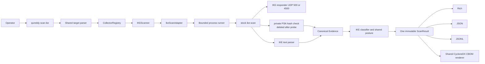
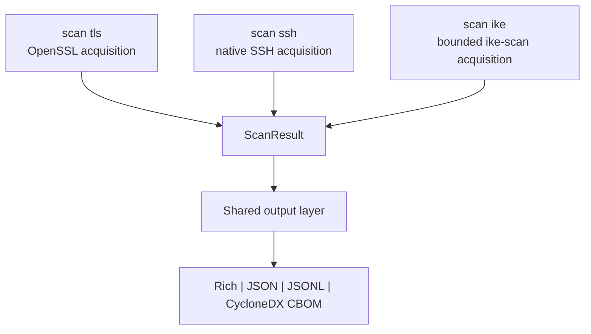

<!-- SPDX-License-Identifier: Apache-2.0 -->

# ADR: Ship the bounded ike-scan backend before the native IKE collector

**Status:** Accepted
**Scope:** Initial `qureddy scan ike` acquisition backend
**Decision issue:** [#633](https://github.com/BreachSAFE/qureddy/issues/633)
**Supersedes:** The initial-backend sequencing and `ike-scan` placement decisions in
[`ike-scanner-adr.md`](./ike-scanner-adr.md)

## Contents

1. [Context](#1-context)
2. [Decision](#2-decision)
3. [Runtime architecture](#3-runtime-architecture)
4. [Ownership and reuse](#4-ownership-and-reuse)
5. [Trust and claim limits](#5-trust-and-claim-limits)
6. [Alternatives considered](#6-alternatives-considered)
7. [Consequences](#7-consequences)
8. [Revisit when](#8-revisit-when)

## 1. Context

The accepted IKE architecture selected a native bounded UDP collector as the first backend and
placed `ike-scan` outside QuReddy. The delivery sequence has changed: QuReddy will ship a stock
`ike-scan` backend first, while the native collector remains planned. The immediate requirements
are a working `scan ike` command, bounded process execution, typed failure states, canonical
`ScanResult` output, and honest handling of the tool's experimental IKEv2 support.

The IKE algorithm registry is separate work. This change cannot claim that a partial hard-coded
table is that registry. It may apply narrow RFC 8247 rules with their source named in each finding.

## 2. Decision

`qureddy scan ike` will use a bounded adapter around the stock `ike-scan` executable for its
initial release. The adapter implements the existing `ToolAdapter` contract, and the IKE scanner
constructs one canonical `ScanResult` consumed by every renderer.

The native collector, exact wire observations, coverage receipts, and request-binding models in
the accepted IKE ADR remain the target architecture for the later native backend. This release
does not introduce those native-only public models.

## 3. Runtime architecture

The process and network edges are trust boundaries. The adapter bounds runtime and combined
output size, records the executable version and output digests, and assigns low confidence to
tool-reported observations. For an Aggressive Mode probe, it validates stock `--pskcrack` output
in a private run-scoped file, emits only the exposure fact, and deletes the file. Renderers receive
the canonical result and never invoke `ike-scan`.

TLS, SSH, and IKE have protocol-specific acquisition and parsing. Core models, semantic posture,
and output projection remain shared. CBOM generation is one renderer with thin protocol selectors.

## 4. Ownership and reuse

| Concern | Owner | Decision |
|---|---|---|
| Target parsing | `core.targets` | Extend the shared endpoint parser |
| Collector and result seams | `core.contracts`, `core.models` | Reuse |
| Process execution | `scanners.ike.execution` | Keep private until a second bounded external tool needs identical semantics |
| `ike-scan` text parsing | `scanners.ike.parser` | Keep protocol-private with one parsed-response value object |
| RFC 8247 classification | `scanners.ike.classify` | Keep narrow and IKE-private until the separate registry lands |
| Posture and rollup | `scanners.common` | Reuse |
| CBOM rendering | `output.cbom` | Reuse the single renderer and shared asset emitter |
| Cipher and MAC projection | `output.cbom_cipher` | Share with TLS and SSH |
| IKE CBOM selection | `output.cbom_ike` | Keep as a thin protocol projection |

## 5. Trust and claim limits

The backend records responder presence, explicit NOTIFY rejection, tool-reported transforms,
Historic IKEv1, and Aggressive Mode identity or PSK-hash exposure. It assigns low confidence to
external-tool observations and omits identity and PSK-hash values from `ScanResult`.

Stock `ike-scan` 1.9.5 labels its IKEv2 support experimental and sends one default proposal. Its
output does not prove comprehensive algorithm support, RFC 9370 additional key exchange
completion, authenticated IPsec posture, favorable post-quantum readiness, or HNDL protection.
Silence remains an explicit unknown result. A NOTIFY remains distinct from silence.

CBOM receives normalized low-confidence observations from `ScanResult`. Raw `ike-scan` text is
never passed directly to the renderer. The CBOM is inventory evidence and does not upgrade an
observation into an accepted proposal, authenticated tunnel, or favorable HNDL result.

## 6. Alternatives considered

The two viable initial-delivery choices were scored from 1 to 5. Higher is better.

| Criterion | Weight | Bounded stock adapter | Wait for native collector |
| --- | ---: | ---: | ---: |
| Time to usable IKE discovery | 30% | 5 | 1 |
| Evidence authority | 30% | 2 | 5 |
| Reuse of current contracts | 20% | 5 | 4 |
| Maintenance and licensing burden | 10% | 3 | 4 |
| Later native migration | 10% | 4 | 5 |
| Weighted score | 100% | **3.80** | **3.30** |

The bounded adapter is selected for initial delivery. Its lower evidence authority is contained by
the claim limits above. Porting the existing spike unchanged was rejected because it retained
duplicate models and output logic. Building the registry was rejected because that work has a
separate owner and acceptance gate.

## 7. Consequences

- Users need a compatible `ike-scan` executable at runtime.
- QuReddy gains IKE discovery before native packet binding and full coverage accounting exist.
- IKEv2 output stays lower confidence and cannot produce a favorable quantum or HNDL claim.
- The scanner, JSON, JSONL, Rich, and CBOM surfaces share one result, preventing renderer rescans.
- A later native backend can replace acquisition behind the collector seam.
- The future registry must replace the narrow classifier policy before adding broader algorithm
  ratings or registry-derived CBOM metadata.

## 8. Revisit when

Revisit this decision when the native IKE collector passes its live-lab acceptance gates, when a
second external scanner needs the same bounded process semantics, or when the separate IKE
algorithm registry is ready for classifier and CBOM integration.
