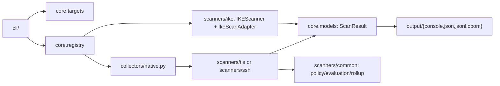
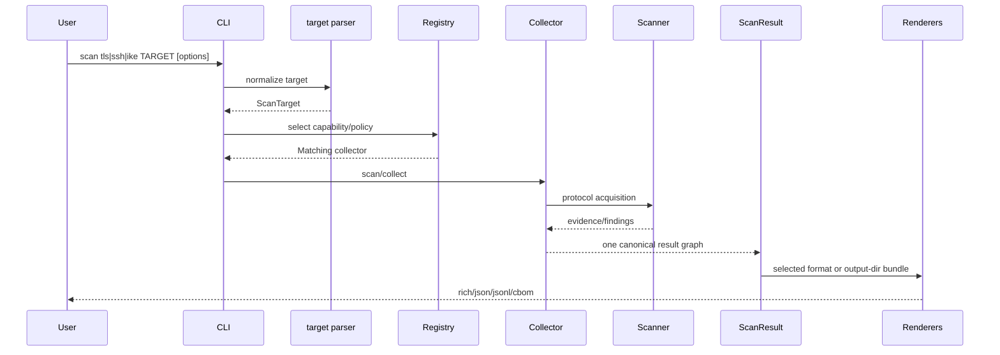
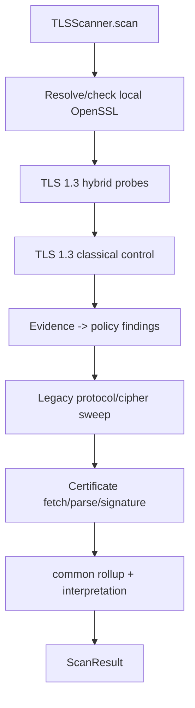
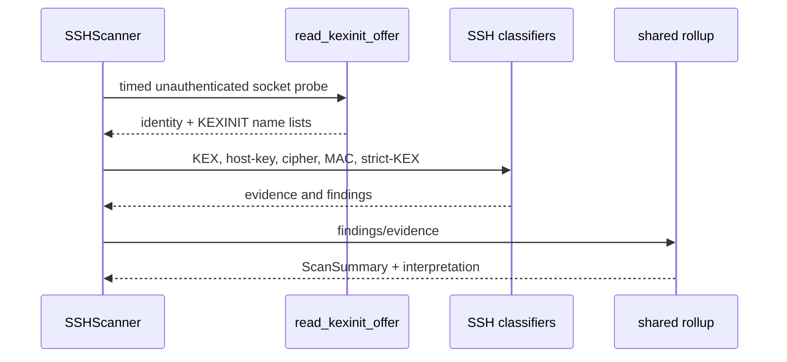

# QuReddy application deep dive

[](https://github.com/BreachSAFE/qureddy)

This is a code-derived reference for maintainers and coding agents. It describes the
canonical implementation at base commit `0da546284a16da8515d400ec5e2e69cb439f684c`.
When a model, scanner seam, CLI command, or output contract changes, update this
document from source and record the new commit. Do not use this document as a reason
to create a parallel model or renderer.

## Contents

1. [Scope and source of truth](#1-scope-and-source-of-truth)
2. [Repository map](#2-repository-map)
3. [Runtime call graph](#3-runtime-call-graph)
4. [Canonical data model](#4-canonical-data-model)
5. [Collection contracts and registry](#5-collection-contracts-and-registry)
6. [TLS pipeline](#6-tls-pipeline)
7. [SSH and IKE pipelines](#7-ssh-and-ike-pipelines)
8. [Evaluation and policy](#8-evaluation-and-policy)
9. [Output projections](#9-output-projections)
10. [Errors, logging, retries, and exit codes](#10-errors-logging-retries-and-exit-codes)
11. [Extension rules](#11-extension-rules)
12. [Tests and quality gates](#12-tests-and-quality-gates)
13. [Known boundaries](#13-known-boundaries)
14. [Agent checklist](#14-agent-checklist)

## 1. Scope and source of truth

The shipped application is a Python CLI package. `pyproject.toml` declares the
install-time entry point as `qureddy = qureddy.cli:main`, requires Python `>=3.14`,
and currently supports the `tls`, `ssh`, and `ike` schemes. The canonical repository is
`github.com/breachsafe/qureddy`; similarly named personal checkouts are not product
source.

The source-of-truth order for behavior is:

1. `src/qureddy/core/models.py` and `src/qureddy/core/contracts.py` for wire and
   collection types.
2. The protocol scanners and their parsers/classifiers for observed facts.
3. `src/qureddy/scanners/common/` for protocol-neutral rollup and interpretation.
4. `src/qureddy/output/` for projections of the canonical result.
5. CLI modules for parsing options, orchestration, stream handling, and exit status.
6. Tests, fixtures, and checked-in schemas for executable contracts.

The existing architecture documentation remains normative for layering:
`docs/architecture/scan-contract.md` and `docs/explanation/architecture.md`.
This document expands those contracts with the concrete implementation inventory.

## 2. Repository map

```text
src/qureddy/
├── __main__.py, __init__.py, _branding.py
├── cli/
│   ├── main.py              root Typer app and top-level error translation
│   ├── scan.py              scan tls command and common CLI orchestration
│   ├── ssh.py               scan ssh command
│   ├── ike.py               scan ike command and stock-tool selection
│   ├── _options.py          shared option declarations/callbacks
│   ├── _execute.py          scanner invocation and result/exit mapping
│   ├── _render.py           output dispatch and --output-dir fan-out
│   ├── _errors.py           usage/operator diagnostics and stream purity
│   └── _help.py             styled help text
├── collectors/
│   └── native.py            NativeTLSCollector and NativeSSHCollector adapters
├── core/
│   ├── models.py            enums and immutable Pydantic result graph
│   ├── contracts.py         ScanSource, collector/tool/scanner protocols
│   ├── registry.py          capability-based collector selection
│   ├── targets.py           TLS/SSH/IKE target parsing and SSRF checks
│   ├── policy.py            finding rules and evidence classification
│   ├── evaluation.py        CISO evaluation value object
│   ├── retry.py             allow-listed retry policy
│   ├── status.py, ids.py    status constants and identifiers
│   ├── logging.py           structlog configuration and run correlation
│   ├── pqc.py, signatures.py, ciphers.py, ssh_algorithms.py
│   │                         algorithm classification helpers
│   ├── certificate.py       parsed certificate observation
│   ├── finding_identity.py  deterministic finding hash
│   └── errors.py             public error hierarchy
├── scanners/
│   ├── tls/                 OpenSSL probes, parsing, certificate, legacy TLS
│   ├── ssh/                 socket KEXINIT probe and SSH classification
│   ├── ike/                 stock-tool adapter, bounded execution, parser, policy
│   └── common/              shared assets, metadata, rollup, posture/evaluation
└── output/
    ├── json.py              one canonical ScanResult document
    ├── jsonl.py             finding records plus one scan_summary record
    ├── cbom.py and cbom_*.py CycloneDX 1.7 projection and semantic helpers
    └── console/              Rich verdict, tables, evidence, and command panels
```

The dependency direction is deliberately one-way:



Renderers must not open sockets, invoke OpenSSL, parse protocol text, or import a
protocol-private scanner. A new protocol belongs behind the collector/scanner seam.

## 3. Runtime call graph

### 3.1 Installed CLI path

```text
console script `qureddy`
  -> qureddy.cli:main
     -> cli.main Typer root / scan_app
        -> scan.scan_tls, ssh.scan_ssh_cmd, or ike.scan_ike_cmd
           -> parse target and options
           -> select collector/scanner
           -> cli._execute._execute_scan
           -> cli._render._render
              -> Rich | JSON | JSONL | CBOM
```

`qureddy.__main__` is the module execution path; it delegates to the same CLI
entrypoint. `main()` configures UTF-8 streams and translates Click/Typer usage
errors to the project exit-code contract. It only prints a traceback for `-vvv`.

### 3.2 One scan, many projections



`--output-dir` does not run the network scan four times. `_render_bundle` renders
the same `ScanResult` once into each current projection: `scan.json`,
`scan.cdx.json`, `scan.jsonl`, and `scan.rich.txt`.

## 4. Canonical data model

All models in `core/models.py` use frozen Pydantic configuration and reject unknown
fields (`extra="forbid"`). Tuples are used for repeatable collections so the result
cannot be mutated after construction.

### 4.1 Enumerations

> The generated inventory of every source enum and class, plus their annotated-field
> relationships, lives in
> [docs/architecture/data-model.md](../architecture/data-model.md) (regenerated by
> `scripts/gen_data_model.py`). The table below is the hand-curated core subset.

| Enum | Values | Meaning |
| --- | --- | --- |
| `ObservationType` | `negotiated`, `offered`, `observed`, `inferred`, `not_offered`, `not_testable`, `no_response` | How an observation was obtained |
| `Severity` | `critical`, `high`, `medium`, `low`, `info` | Finding urgency |
| `Readiness` | `quantum_vulnerable`, `classically_weak`, `transitional_hybrid`, `quantum_safe`, `unknown`, `not_applicable` | Per-finding and scan readiness |
| `PqcSupport` | `hybrid_observed`, `pure_pq_observed`, `classical_only_observed`, `unknown`, `not_testable` | PQ key-exchange support axis |
| `AxisStatus` | `hybrid`, `pure_pq`, `classical`, `acceptable`, `action_needed`, `unknown`, `not_testable`, `not_applicable` | Status of a posture axis |
| `HndlExposure` | `protected`, `protected_defeasible`, `at_risk`, `unknown` | Future harvest-now/decrypt-later risk |
| `HygieneStatus` | `ok`, `action_needed`, `weak`, `unknown` | Present-day protocol hygiene |
| `Confidence` | `high`, `medium`, `low` | Confidence in a finding |
| `ProbeRole` | `hybrid_readiness`, `classical_control`, `hybrid_coverage` | Why a TLS probe ran |
| `OutputFormat` | `rich`, `json`, `cbom`, `jsonl` | CLI projection |

`FailureCategory` additionally distinguishes local OpenSSL capability failures from
target, handshake, middlebox/MTU, and parser failures. This is important: target
failures are represented as failure data, while local capability failures have a
typed exception path and exit code 3.

### 4.2 Result graph

```text
ScanResult
├── schema_version: str = "qureddy.scan.v1"
├── scan: ScanMetadata
├── target: ScanTarget
├── dependencies: tuple[OpenSSLDependency | ExternalToolDependency, ...]
├── assets: tuple[Asset, ...]
├── evidence: tuple[Evidence, ...]
├── findings: tuple[Finding, ...]
└── summary: ScanSummary
    └── interpretation: ScanInterpretation | None
        ├── display: InterpretationDisplay
        ├── axes: PostureAxes
        └── reason_codes/evidence_refs/policy identity
```

### 4.3 Field inventory

| Type | Fields and invariants |
| --- | --- |
| `ScanTarget` | `original_input`, validated `host`, `port` 1–65535, optional `sni`, `scheme` (`tls`/`ssh`/`ike`), canonical `locator`; a model validator requires locator consistency |
| `OpenSSLDependency` | `name`, `path`, `version`, capability booleans, optional `failure_category` |
| `ExternalToolDependency` | `name`, resolved path, version, and optional typed failure for an executable-backed collector |
| `ProbeCommand` | executable, tuple args, timeout, redacted flag |
| `ProbeResult` | command, return code, SHA-256 hashes of stdout/stderr, bounded excerpts, duration, attempt number, optional failure; raw parser input is excluded from serialization |
| `Asset` | stable id/type/locator/display name, protocol and version, algorithm/primitive/parameter set, key size, negotiated group, CBOM ref/OID, NIST quantum level |
| `Evidence` | id, asset id, evidence type, observation type, source, protocol fields, algorithm/probe metadata, optional `ProbeResult`, failure, confidence, notes; captured certificate is excluded from normal serialization and consumed by CBOM |
| `Finding` | id, asset id, at least one evidence id, rule id, type/title/description, severity/readiness/confidence, optional crypto and protocol attributes |
| `ScanProvenance` | distribution, source revision, dirty-state, container digest |
| `ScanMetadata` | scan id, start/completion timestamps, scanner name/version, status, total attempts, optional provenance |
| `ScanSummary` | target locator, finding count, highest severity, rolled-up readiness, optional failure category, optional interpretation |
| `PostureAxes` | `pqc_support`, `key_exchange`, `downgrade_resistance`, `authentication`, `protocol_hygiene` |
| `ScanInterpretation` | effective status/headline/action, CISO display, HNDL/hygiene enums, axes, reason codes, evidence refs, policy id/version |
| `PostureEvaluation` | summary, HNDL risk, protection, hardening, recommended action, observed facts |

Evidence is the audit trail; findings are decisions over evidence; summary is the
rollup. Do not put raw probe output directly into a renderer or make a renderer infer
findings.

## 5. Collection contracts and registry

`core/contracts.py` defines the protocol-neutral seams:

- `SourceKind`: `endpoint`, `ssh_public_key`, `ssh_config`, `certificate`,
  `static_inventory`.
- `ToolPolicy`: `auto`, `native`, `openssl`, `ssh-audit`, `ike-scan`.
- `Capability`: TLS endpoint, SSH endpoint/key/config, IKE endpoint, and X.509 certificate.
- `ScanSource`: frozen validated locator plus protocol and string metadata.
- `CollectionFailure`: typed kind/message/retryable value.
- `CollectionResult`: collector/version, evidence, findings, provenance, failure,
  and optional `scan_result`.
- `ToolAdapter` and `Collector`: acquisition interfaces.
- `Scanner` and `ScanCollector`: runtime-checkable scan interfaces.

`CollectorRegistry` is a small dataclass with a list of registered collectors. It
rejects duplicate collector names, maps a `ScanSource` to a capability, filters by
`ToolPolicy`, and verifies that a selected scanner implements `ScanCollector`.
Native collectors are named `native-tls` and `native-ssh`; policy `native` matches
that prefix. The stock IKE collector is named `ike-scan`; other policies match a
collector name exactly.

```text
ScanSource -> _capability_for -> registry.select -> Collector
                                      |
                                      +-- select_scanner -> ScanCollector
```

This is also the extension point used by the IKE external tool. Its adapter returns
the same evidence/finding/result types and does not add a second output or posture
model.

## 6. TLS pipeline

`TLSScanner.scan()` delegates to `_run_tls_scan`:

1. `_begin` allocates a scan id, clears/binds structlog context, and logs `scan.start`.
2. `_check_capability` calls `resolve_openssl_with_capability` before target probes.
3. `build_asset` creates the endpoint asset.
4. `_collect_evidence` runs every configured TLS 1.3 hybrid group. The first group is
   `HYBRID_READINESS`; other groups are `HYBRID_COVERAGE`.
5. The classical TLS 1.3 control probe runs with `ProbeRole.CLASSICAL_CONTROL`.
6. `classify_evidence` creates findings from evidence.
7. `_collect_optional_axes` runs the legacy TLS 1.0/1.1/1.2 and cipher sweep, then
   the independent leaf-certificate fetch/parse/signature check, unless evidence
   already indicates an unreachable target.
8. `_completed_scan_result` builds metadata, rolls up summary, and returns one result.



OpenSSL execution is isolated in `scanners/tls/openssl_probe/`: resolver and
capability check, argument construction, subprocess executor, output parser, and
probe result builders. Each invocation carries an argument vector and timeout and
captures bounded/log-safe evidence. Retry is applied only to the configured probe
categories; the multi-handshake legacy sweep is deliberately not retried as a whole.

The certificate path is independent of key-exchange success. A missing certificate
does not erase a valid key-exchange result; a local OpenSSL absence is not swallowed
because capability checking has already failed the scan.

## 7. SSH and IKE pipelines

### SSH

`SSHScanner.scan()` calls `_scan_ssh`:

1. `read_kexinit_offer` opens a timed socket, reads the server identification and
   KEXINIT offer, then closes without authentication or channel creation.
2. `_kex_observations` emits one offered-evidence record per unique KEX group and a
   hybrid or classical verdict finding. If both are offered it adds a classical
   downgrade-alternative finding.
3. `server_identity_observations` records server identity evidence.
4. `_host_key_observations` records every host-key algorithm and a weak finding when
   applicable.
5. `_cipher_mac_observations` records every cipher and MAC and a weak-transport
   finding when applicable.
6. `terrapin_observation` records strict-KEX/cipher/MAC posture.
7. `_build_ssh_success_result` uses the shared readiness/severity rollup and posture
   interpreter.



SSH uses the same `ScanTarget`, `Asset`, `Evidence`, `Finding`, `ScanResult`, and
renderers as TLS. Its protocol-specific vocabulary stays in `scanners/ssh/` and
`core/ssh_algorithms.py`.

### IKE

`IKEScanner.scan()` builds a bounded probe plan for IKEv1 Main Mode, IKEv1
Aggressive Mode, and IKEv2. With `--nat-t`, each mode probes UDP/4500 first and
falls back to the requested port only when that mode did not respond. This avoids
double-counting successful NAT-T and direct passes.

`IkeScanAdapter` resolves and versions stock `ike-scan`, executes an argument
vector under time and output bounds, and parses its untrusted text. The parser
normalizes responder modes, transform algorithms, numeric group identifiers,
NOTIFY responses, and Aggressive Mode identity or PSK-hash exposure into `Evidence`.
The PSK-hash check uses a private run-scoped file that is deleted before the
adapter returns; only the exposure fact enters `ScanResult`.
`classify_ike` then creates findings; the common rollup and output fan-out are the
same ones used by TLS and SSH.

```mermaid
flowchart LR
    CLI["scan ike"] --> Registry["CollectorRegistry"]
    Registry --> Scanner["IKEScanner"]
    Scanner --> Adapter["IkeScanAdapter"]
    Adapter --> Process["bounded stock ike-scan"]
    Process --> Parser["IKE text parser"]
    Parser --> Evidence["canonical Evidence"]
    Evidence --> Policy["classify + common rollup"]
    Policy --> Result["one ScanResult"]
    Result --> Outputs["Rich / JSON / JSONL / CBOM"]
```



The stock adapter is lower-trust discovery. It does not claim peer
authentication, IKE_AUTH completion, Child-SA creation, RFC 9370 additional key
exchange, or an installed SA. The numeric `ike_group_id` is an optional field on
the shared `Evidence` model; there is no second IKE result graph.

## 8. Evaluation and policy

`core.policy.classify_evidence` applies declarative `PolicyRule`/`RuleCondition`
objects to an asset and evidence. It does not render output. Protocol adapters then
call `scanners.common.posture.build_interpretation`.

The common evaluation path is:

```text
findings + evidence
  -> derive_signals (stable SemanticSignal taxonomy)
  -> normalize_facts (PostureFacts; no raw parsing)
  -> build_evaluation (CISO language)
  -> build_interpretation (axes, reason codes, display)
```

`PostureFacts` contains protocol, PQ support, HNDL exposure, hygiene status,
negotiated algorithm, classical alternative, certificate-chain signature, and weak
algorithm names. `PostureSignals` is the neutral intermediate: hybrid/pure-PQ/
classical KEX, probe failure, downgrade action, authentication, certificate,
legacy, weak algorithm, protocol action, and semantic signals.

The HNDL and hygiene axes are intentionally independent:

- hybrid plus a classical alternative → `protected_defeasible`;
- pure PQ or hybrid without a classical alternative → `protected`;
- classical-only → `at_risk`;
- weak algorithms affect present-day hygiene and recommended hardening, not the
  cryptographic meaning of a successful PQ probe.

Readiness and severity use shared functions in `scanners/common/rollup.py`. Readiness
precedence is `classically_weak`, `quantum_safe`, `transitional_hybrid`,
`quantum_vulnerable`, `unknown`, `not_applicable`; severity uses an explicit order.
Empty findings are safe and return `unknown`/`None` rather than raising from `max()`.

## 9. Output projections

All renderers accept a `ScanResult` and a caller-supplied text stream. They are
serialization adapters, not scanners.

### 9.1 Rich

`output.console.render` composes the verdict panel, summary/run-detail tables,
findings, evidence, and command panels. `min_severity` filters only the human
findings table; it does not mutate or truncate the canonical result.

### 9.2 JSON

`output.json.render_json` calls `result.model_dump(mode="json")`, preserving the
model's top-level order: `schema_version`, `scan`, `target`, `dependencies`,
`assets`, `evidence`, `findings`, `summary`. Pretty output is the default;
`--compact` emits one minified document. Exactly one JSON document plus newline is
written.

### 9.3 JSONL

`output.jsonl.render_jsonl` emits one compact record per finding, sorted by the
deterministic `finding_hash`, followed by exactly one `type: scan_summary` record.
Finding records include nuclei/Osmedeus-compatible fields (`template-id`, `type`,
`host`, `matched-at`, `url`, `port`, `ip`, `timestamp`, `matcher-name`,
`extracted-results`, `finding_hash`) and an `info` object with severity, description,
classification, and QuReddy metadata. The summary record carries axes,
interpretation, reason codes, policy identity, and scan identity.

### 9.4 CycloneDX CBOM

`output.cbom.render_cbom` delegates to `cyclonedx-python-lib` 11.x for CycloneDX 1.7
serialization. It creates an endpoint metadata component, records QuReddy/OpenSSL
or external-tool provenance, then adds algorithm, protocol, legacy cipher, SSH, IKE, and captured
certificate components. Evidence occurrences and finding annotations are attached
after serialization where the library lacks the required 1.7 fields; those patches
are intentionally narrow and validated by the CBOM conformance tests.

The CBOM consumes the captured certificate in `Evidence`; it does not refetch the
endpoint. `--reproducible` removes per-run serial/timestamp identity while retaining
observed cryptographic content. Semantic validation checks duplicate refs, dangling
refs, and required relationships.

### 9.5 Output directory

`cli._render._render_bundle` renders all four projections from one result:

```text
<output-dir>/
├── scan.json
├── scan.cdx.json
├── scan.jsonl
└── scan.rich.txt
```

`--output` and `--output-dir` are mutually exclusive. Directory/file creation is
validated before scan work and failures map to usage exit code 4.

## 10. Errors, logging, retries, and exit codes

### 10.1 Error boundary

`QureddyError` is the public base. It includes target/CBOM/certificate/retry/SSH
errors and typed local OpenSSL capability subclasses. Target and handshake/parser
failures are captured as `FailureCategory` in result evidence where possible. The CLI
maps local capability exceptions to a structured result and exit 3; target scan
exceptions become exit 2 (or a machine-readable failure result).

### 10.2 Exit contract

| Code | Meaning |
| ---: | --- |
| 0 | Scan completed without a target failure |
| 2 | Target connection, handshake, middlebox, or parser failure |
| 3 | Required local OpenSSL or stock `ike-scan` dependency failure |
| 4 | Usage, target syntax, option, output, or log-path error |
| 70 | Unhandled internal error |

The root CLI translates Click/Typer usage exceptions so usage remains 4 rather than
colliding with target failure 2. Human-mode scan failures raise `typer.Exit(2)`;
machine formats preserve one parseable document and send diagnostics to stderr.

### 10.3 Logging and stream purity

`core.logging` configures structlog, and TLS binds `scan_id` and target context at
scan start. Machine formats default to quiet stderr unless verbosity or `--log` is
explicitly requested. `_errors.py` detects when stderr is merged into stdout and
suppresses courtesy diagnostics that would corrupt a single machine document.
`-vvv` enables subprocess detail and uncaught tracebacks at the CLI boundary.

### 10.4 Retry boundary

`core.retry.run_with_retries` accepts an allow-list of `FailureCategory`, retry count,
and delay. Only explicitly selected categories retry. CLI parsing validates retry
arguments. TLS applies retries to individual hybrid/classical probes; the legacy
multi-protocol sweep is not retried as one unit. SSH's unauthenticated offer probe is
one bounded operation. IKE bounds each external-tool attempt independently and does
not use the TLS retry policy.

## 11. Extension rules

Before adding code, answer these questions:

1. Is this a new observation, finding, axis, source, or projection? Extend the
   existing typed seam instead of creating a parallel dictionary/model.
2. Does the information belong to protocol vocabulary? Keep it in that scanner;
   only neutral signals belong in `scanners/common`.
3. Can an existing `Asset`, `Evidence`, `Finding`, and `ScanSummary` represent it?
   If yes, do not add a second result graph.
4. Is this a new tool? Put it behind a collector-owned `ToolAdapter` with explicit
   version, timeout, return status, and parser evidence.
5. Is this a new output? Add one renderer consuming `ScanResult`; do not rescan.
6. Does `--output-dir` remain one scan with multiple projections?
7. Are JSON, JSONL, Rich, and CBOM parity tests added for any new semantic fact?

Do not make output code import scanner-private modules. Do not make one collector
mutate another collector's result. Do not encode a posture verdict from a display
string. Do not duplicate the rollup or evaluation logic in a protocol scanner.

## 12. Tests and quality gates

The tests mirror the architecture:

| Area | Representative tests |
| --- | --- |
| Models/target invariants | `test_models.py`, `test_targets.py`, `test_targets_properties.py` |
| Collector contracts/selection | `test_contracts.py`, `test_registry.py`, `test_native_collectors.py`, `test_scanner_contract.py` |
| TLS/OpenSSL/parser | `test_openssl_*.py`, `test_tls_parse.py`, `test_scanner.py`, certificate/legacy tests |
| SSH | `test_ssh_probe.py`, `test_ssh_scanner.py`, `test_ssh_classify.py`, peer-close/error tests |
| IKE | `test_ike_execution.py`, parser-negative tests, policy tests, and `tests/ike_lab/test_live_ike.py` against real stock `ike-scan` |
| Evaluation/rollup | `test_evaluation.py`, `test_posture.py`, `test_semantic_signals.py`, `test_scanner_rollup.py` |
| Output contracts | `test_output.py`, `test_jsonl.py`, `test_cbom*.py`, `test_console_panels.py`, golden tests |
| Architecture/docs/CI | `test_architecture_boundaries.py`, `test_docs_contract.py`, `test_ci_workflows.py` |
| Release/supply chain | `test_release_gate.py`, conformance final-byte tests, `scripts/release_gate.py` |

The repository's `justfile` defines the primary local gates: `just lint`,
`just format-check`, `just typecheck`, `just test`, `just gates`, `just reuse-lint`,
and `just release-gate`. The release gate uses Python 3.14, builds a wheel/sdist,
installs smoke environments, runs `twine check`, validates CBOM final bytes, and
records evidence. CI additionally runs architecture, duplicate-code, secret,
coverage, conformance, and workflow-specific checks. A green job that was skipped is
not a passing gate; report skipped matrix entries as `NOT RUN`.

For this document, the source snapshot was inspected directly. Validation should be
repeated after edits with the repository's Python 3.14 environment:

```bash
/opt/homebrew/bin/python3.12 -m compileall -q src  # host fallback only if 3.14 is unavailable
uv run --locked pytest --ignore=tests/live --cov=qureddy --cov-fail-under=90
uv run --locked ruff check .
uv run --locked ruff format --check .
uv run --locked mypy src/qureddy --strict
uv run --locked reuse lint
```

The project guidance requires Python 3.14 for normal gates; the first command above
is a syntax-only fallback and must not be reported as the full quality gate.

## 13. Known boundaries

- Current native endpoint coverage is TLS and SSH. IKE is an executable-backed
  collector through stock `ike-scan`; it is not a native implementation.
- The native TLS scanner invokes OpenSSL subprocesses; the SSH scanner uses a direct
  socket offer probe; IKE invokes a registered, bounded external-tool adapter.
- `scan_ssh` remains a compatibility function; `SSHScanner` is its contract adapter.
- CBOM library-gap patches are confined to `output/cbom.py`; do not spread raw JSON
  post-processing into other output modules.
- Certificate evidence is intentionally captured once and reused by findings,
  evaluation, JSON/JSONL, Rich, and CBOM.
- Version/release metadata lives in packaging and release documents; general docs
  should describe contracts rather than hard-code a release number.

These are implementation boundaries, not TODOs to fill by adding speculative code.
Confirm an issue and an approved contract before extending them.

## 14. Agent checklist

Before changing QuReddy:

1. Confirm the checkout is canonical and record `git rev-parse HEAD`.
2. Read `CLAUDE.md`, this document, the [coding rules](coding-rules.md), and the
   relevant architecture contract. Apply the [commenting contract](coding-rules.md#section-10--comments-and-docstrings)
   to every changed boundary and regression test.
3. Trace the existing call path and locate the canonical model field.
4. Reuse `ScanResult`/`Evidence`/`Finding`; do not invent a result dictionary.
5. Keep acquisition, policy, evaluation, and rendering in their existing layers.
6. Add or update fixtures and parity tests before changing output behavior.
7. Pressure-test real CLI behavior in an isolated temporary workspace.
8. Run the applicable gates and record exact commands and skipped jobs.
9. Review for duplicate logic, protocol leakage into renderers, stream corruption,
   missing failure data, and undocumented new fields.
10. Update this deep dive when the architecture or data model genuinely changes.

If a proposed change cannot be placed in this flow, stop and write an architecture
decision or issue first. More code is not a substitute for a missing contract.
